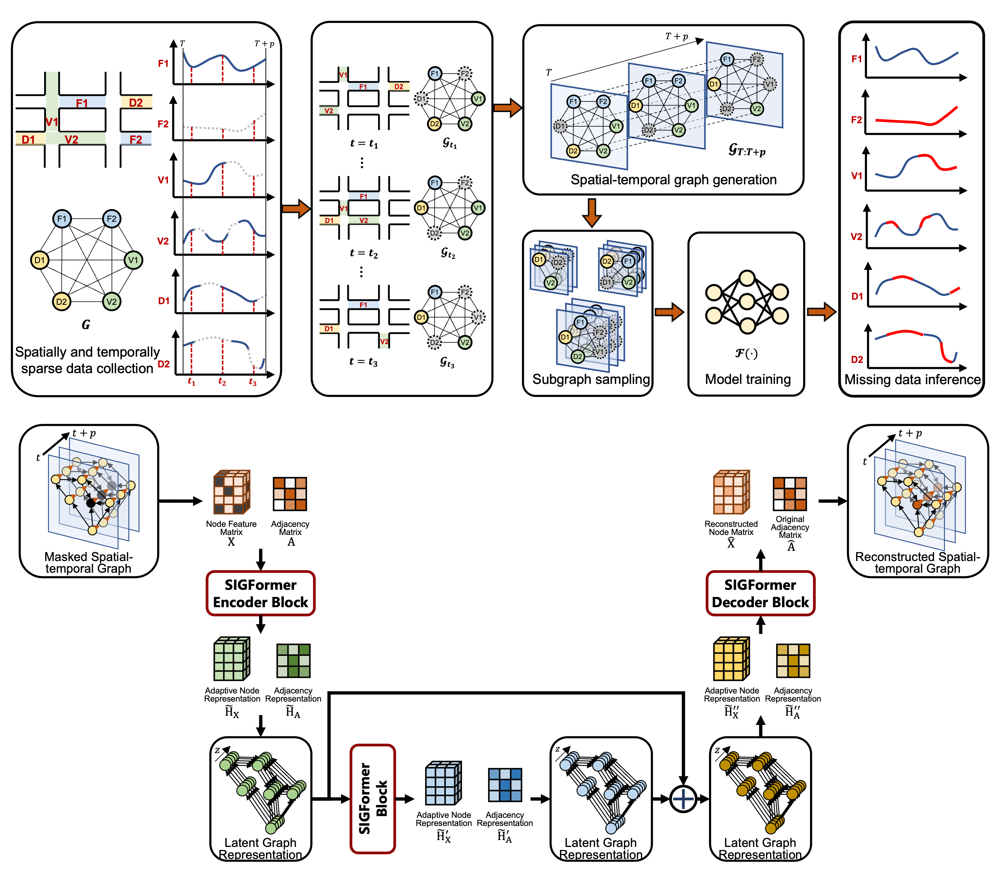
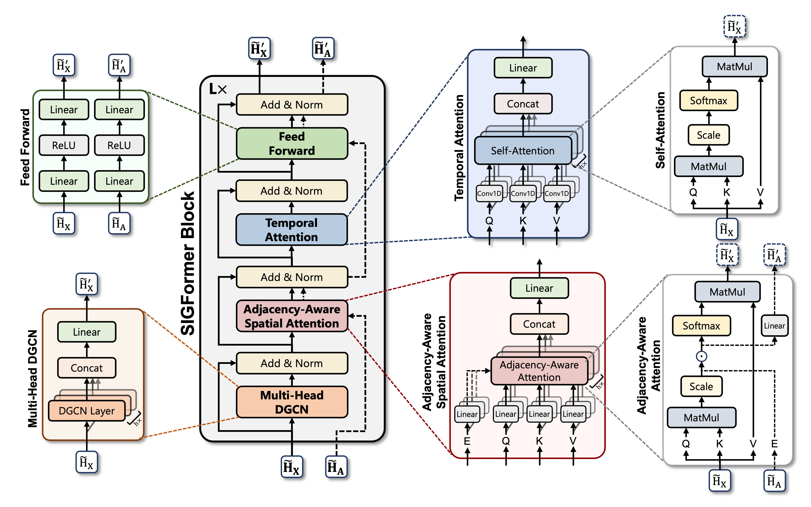

<h2 align="center"> SIGFormer: <br/>Spatial-Temporal Inductive Graph Transformer </h2>

`SIGFormer` is a deep learning model for spatio-temporal forecasting and imputation in transportation networks. By leveraging sparse sensor data—such as that collected from fixed sensors, drones, and mobile vehicles—`SIGFormer`reconstructs missing traffic information with high accuracy. 

This repository implements `SIGFormer` as described in the paper:

***"A Deep Learning Enabled Economical Transportation Informatization Framework with Sparsely Located Sensors"*** 📄

---

## Project Structure
```
.
├── config.yaml # Model, training, and dataset parameters. 
├── model_sigformer.py # SIGFormer model definition. 
├── train.py # Training pipeline. 
├── evaluate.py # Evaluation routines. 
├── experiment_pattern.ipynb # Notebook for missing pattern experiments. 
├── sensitivity_analysis.ipynb # Notebook for hyperparameter sensitivity analysis. 
├── utils.py # Data loading and graph construction utilities. 
├── generate_mask.py # Functions for generating missing masks. 
├── good_id.txt # "Good" sensor IDs for experiments. 
├── main.py # Unified entry point for training and evaluation. 
└── README.md # Project documentation.
```
---

## Framework Overview 🔍

<p align="center">
  
</p>

---
## Model Architecture

<p align="center">
  
</p>

**SIGFormer** is composed of several key components:
- **Diffusion Graph Convolution (D_GCN):** Implements a diffusion process using Chebyshev recurrence to capture spatial dependencies.
- **Multi-Head DGCN:** Aggregates outputs from multiple D_GCN layers to capture diverse spatial relationships.
- **Edge-Aware Spatial Attention:** Enhances node features by incorporating learned edge information.
- **Temporal Transformer:** Utilizes multi-head temporal attention and a feed-forward network to capture temporal dependencies.
- **SIGFormerBlock:** Integrates all the above components with residual connections and normalization.
- **SIGFormer:** Stacks multiple SIGFormerBlocks to form the complete model.

---

## Configuration

All configurable parameters are stored in `config.yaml`. 

---

## Training 🚀

The training pipeline in `train.py`:
- Loads the dataset and splits it into training, validation, and test sets.
- Dynamically selects unknown sensor sets based on a specified ratio (`R_MI`).
- Iterates over the missing patterns defined in the configuration.
- Trains the SIGFormer model for a fixed number of epochs.
- Evaluates performance on the validation set and saves the best model checkpoint per missing pattern.
- Logs training results (MAE, RMSE, MAPE) to a CSV file.

### Running Training

Run training via the unified main entry point:
```bash
python main.py 
```
or
```bash
python main.py --config config.yaml --dataset pems_flow --missing_patterns cs s t b r --r_m 0.4 --r_mi 0.25 --output_csv results.csv
```

---

## Evaluation 📊
The evaluation routines in `evaluate.py`:

- Process the test set using non-overlapping windows.
- Impute missing values using a generated missing mask.
- Compute error metrics (MAE, RMSE, MAPE) to assess model performance.


### Running Evaluation
- Evaluate a trained model by running:
```bash
python main.py --test 
```
or
```bash
python main.py --test --dataset pems_flow --unknown_ratio 0.25 --output_dir evaluation_results --checkpoint <path_to_checkpoint>
```

---

## Experiments
### Experiment: Missing Pattern Comparison

The `experiment_pattern.ipynb` notebook (and its script version) compares reconstruction performance under different missing patterns (e.g., cs, s, t, b, r) on a selected subset of sensors.

### Experiment: Sensitivity Analysis
The `sensitivity_analysis.ipynb` notebook is provided for interactive sensitivity analysis of training and inference missing ratio.

---

## Data
### PeMS flow data
The dataset comes from PeMS Data Clearinghouse at Caltrans Performance Measurement System (PeMS) (Link: http://pems.dot.ca.gov/).
* data/pems_flow/node_values.npy: Flow data
* data/pems_flow/adj_mat.npy: Adjacency matrix
* data/pems_flow/graph_sensor_locations.csv: Latitude and longitude of sensors

### SeData
SeData is collected by the inductive loop detectors deployed on freeways in Seattle area (Link: https://github.com/zhiyongc/Seattle-Loop-Data).
 * data/sedata/mat.csv: Speed data
 * data/sedata/A.mat: Adjacency matrix

---

## Dependencies
Ensure the following dependencies are installed:
- torch
- numpy
- matplotlib
- seaborn
- scienceplots
- pyyaml
- pandas
- scipy


